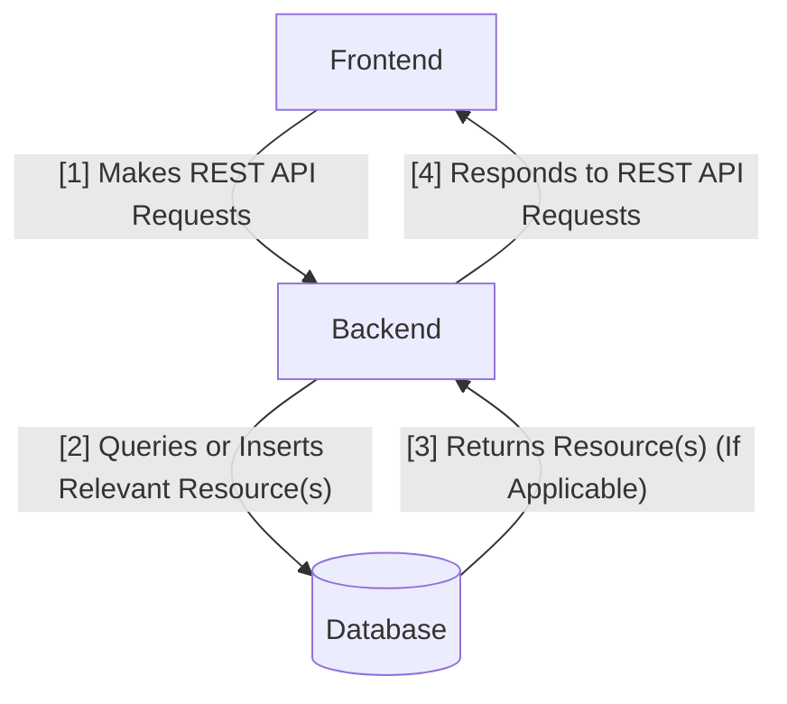
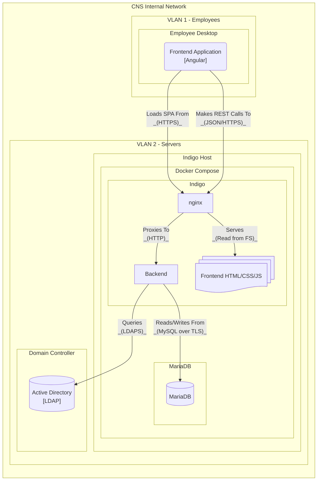

# Design

## Standards

To ensure Indigo can be useful to the broadest possible audience, this project
is committed to adhering to any applicable industry standards.

### Inform USA Spec

lorem ipsum

### WCAG 2.0

lorem ipsum

### HIPAA

lorem ipsum

## Architecture

Indigo is designed in line with the REST (Representational State Transfer)
software design pattern. Using this pattern allows for a separation of concerns
that enables modularity, simplifying work if one component grows out of date.

The following details a high-level overview of the default components:

### Database

The core of this application, as with many others, is the database. It's not
special in any particular way; it's just a container for structured data. By
using a generic component for this important task, we're able to integrate with
existing tools people already know.

### Backend

Common in modern web applications is a backend application. Using an MVC
(Model-View-Controller) pattern, the backend provides an interface for a client
to interact with the database in an intuitive manner.

### Frontend

### Detailed Example

In an ideal deployment, Indigo is deployed as detailed in the diagram below.
Notably, all connections that run outside the Indigo container are encrypted.
When running in a production environment, encrypted connections are
**required** by the backend.

